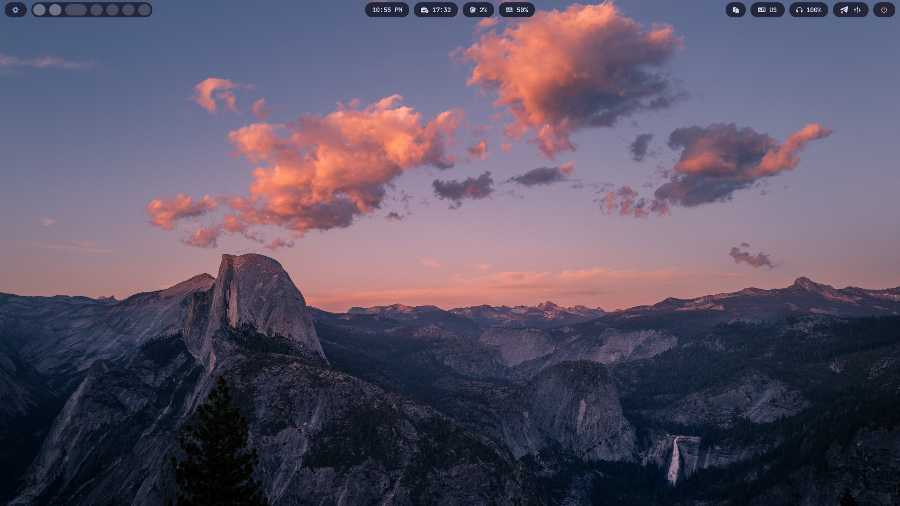
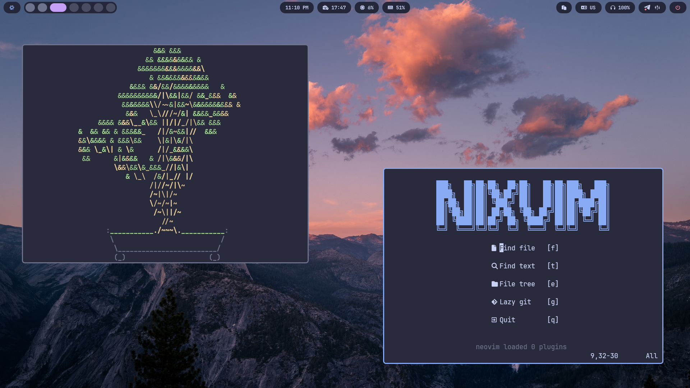
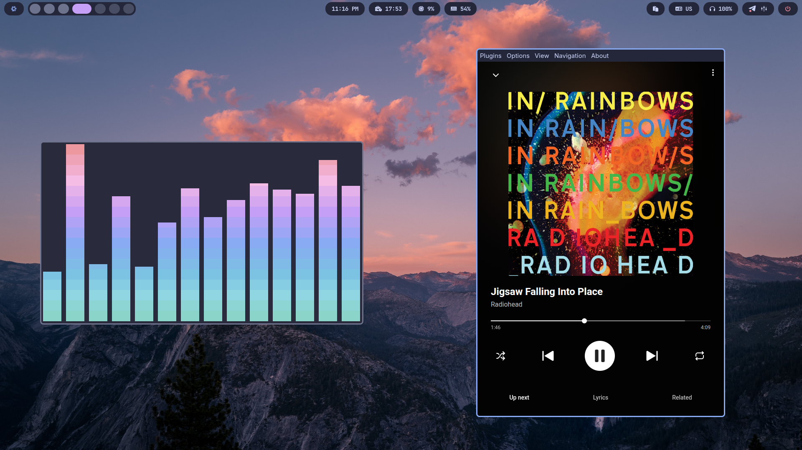
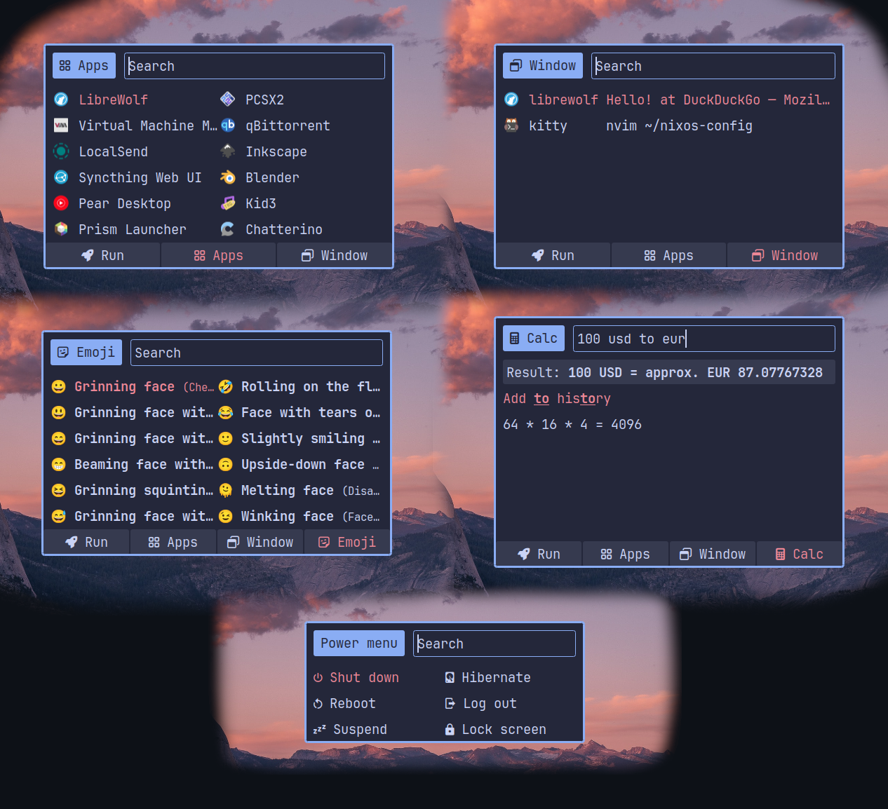

# ❄️ NixOS Configuration by murfixtap

- **WM:** Hyprland
- **Terminal:** Kitty
- **Shell:** Fish
- **Editor:** Neovim (Nixvim), Zed
- **Launcher:** Rofi
- **Bar:** Waybar
- **Browser:** LibreWolf, Firefox
- **File manager:** Yazi, Thunar
- **Theme:** Catppuccin Macchiato (Stylix)
- **Audio:** PipeWire, EasyEffects

## Clone and build:

```bash
git clone https://github.com/murfixtap/nixos-config.git ~/nixos-config
```

```bash
sudo nixos-rebuild switch --flake ~/nixos-config#luna
```

## Screenshots:








